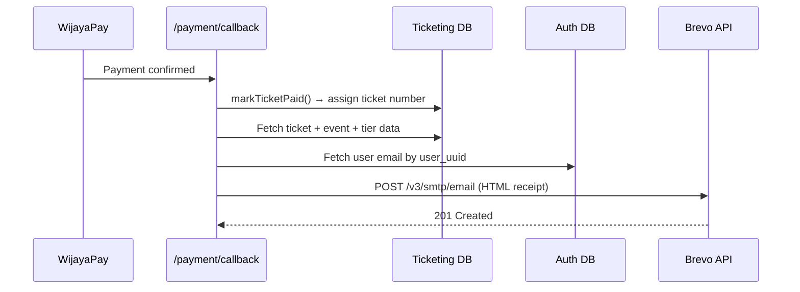

# Purchase Confirmation Email via Brevo

Send purchase confirmation emails via **Brevo REST API** directly from the payment callback — no Queue needed.

## Architecture



## Proposed Changes

### 1. Brevo Email Sender

#### [MODIFY] [email.ts](file:///d:/SERVER/Furban-Web/backend-ticketing/src/services/email.ts)

Replace the queue-based approach with direct Brevo API calls via `fetch`:

```ts
// Brevo REST API: POST https://api.brevo.com/v3/smtp/email
// Header: api-key: <BREVO_API_KEY>
// Body: { sender, to, subject, htmlContent }
```

- Remove [EmailService](file:///d:/SERVER/Furban-Web/backend-ticketing/src/services/email.ts#9-78) queue constructor
- Add `brevoApiKey` param instead
- [sendPurchaseReceipt()](file:///d:/SERVER/Furban-Web/backend-ticketing/src/services/email.ts#12-41) → builds HTML + calls Brevo API directly
- Enrich the email data with: `nickname`, `food_selection`, `drink_selection`, `event date/time`, `location`

---

### 2. Wire into Payment Flow

#### [MODIFY] [payment.ts](file:///d:/SERVER/Furban-Web/backend-ticketing/src/routes/payment.ts)

Expand [markTicketPaid()](file:///d:/SERVER/Furban-Web/backend-ticketing/src/routes/payment.ts#568-588) signature to accept `AUTH_DB` + `BREVO_API_KEY`:

1. After assigning ticket number → fetch full ticket+event+tier data in one query
2. Fetch user email from `AUTH_DB`
3. Call `EmailService.sendPurchaseReceipt()`
4. Wrap in try/catch so email failure **never** blocks the payment confirmation

Update both call sites:
- Line 557 (callback) — pass `c.env.AUTH_DB`, `c.env.BREVO_API_KEY`
- Line 428 (status check) — same

---

### 3. Add Brevo API Key Binding

#### [MODIFY] [wrangler.toml](file:///d:/SERVER/Furban-Web/backend-ticketing/wrangler.toml)

Add secret (set via `wrangler secret put BREVO_API_KEY`):
```toml
# No change to file — BREVO_API_KEY is a secret, set via CLI
```

#### [MODIFY] [types.ts](file:///d:/SERVER/Furban-Web/backend-ticketing/src/types.ts)

Add `BREVO_API_KEY: string` to [Bindings](file:///d:/SERVER/Furban-Web/backend-ticketing/src/types.ts#6-18).

---

### 4. Email HTML Template

The purchase receipt email will contain:

| Field | Source |
|-------|--------|
| Recipient name | `tickets.first_name + last_name` |
| Recipient email | `AUTH_DB → users.email` |
| Event name | `events.event_name` |
| Event date | `events.start_time` |
| Location | `events.location_name` |
| Tier | `ticket_tiers.tier_name` |
| Ticket # | `tickets.ticket_number` |
| Nickname | `tickets.nickname` |
| Amount paid | `purchase_log.amount_paid` or `ticket_tiers.price_total` |
| Food selection | `tickets.food_selection` (parsed JSON) |
| Drink selection | `tickets.drink_selection` (parsed JSON) |

Sender: `tickets@furban.my.id` / `Furban Ticketing`

---

### Files Summary

| File | Change |
|------|--------|
| [email.ts](file:///d:/SERVER/Furban-Web/backend-ticketing/src/services/email.ts) | Rewrite to use Brevo REST API |
| [payment.ts](file:///d:/SERVER/Furban-Web/backend-ticketing/src/routes/payment.ts) | Wire email into [markTicketPaid()](file:///d:/SERVER/Furban-Web/backend-ticketing/src/routes/payment.ts#568-588) |
| [types.ts](file:///d:/SERVER/Furban-Web/backend-ticketing/src/types.ts) | Add `BREVO_API_KEY` to Bindings |
| [emailConsumer.ts](file:///d:/SERVER/Furban-Web/backend-ticketing/src/queue/emailConsumer.ts) | Keep as-is (unused, no changes) |

## Verification Plan

### Manual Verification
1. Set Brevo API key: `wrangler secret put BREVO_API_KEY`
2. Deploy → purchase a test ticket → complete payment
3. Check inbox for the purchase confirmation email
4. Verify `wrangler tail` logs show `[Email] Sent purchase receipt to ...`
5. Confirm email failure does **not** break the payment callback (returns `{ status: true }` regardless)
